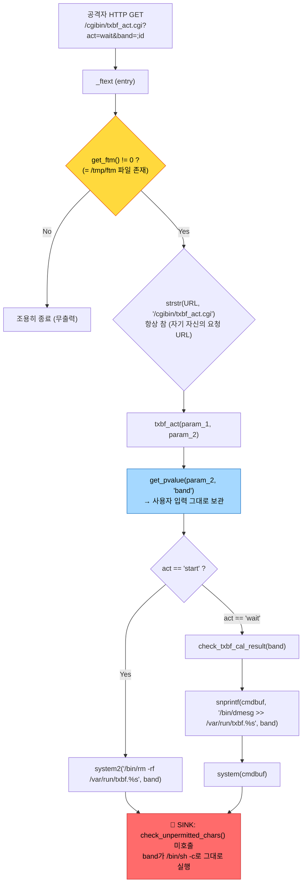
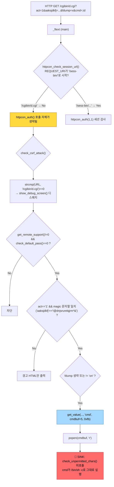

[ax2004-final-security-report.md](https://github.com/user-attachments/files/30895835/ax2004-final-security-report.md)
# ipTIME AX2004 펌웨어 보안 분석 최종 보고서

작성일: 2026-08-09
대상: `ax2004_ml_14_174.bin` (ipTIME AX2004 유무선 공유기 펌웨어)
원본 SHA-256: `188a7dbdd08cb769dd4cc3673b12f9fe674ca36ad25d6b907b267b9c2976745f`

> 이 문서는 프로젝트 내 Task 1~10의 산출물(`analysis/`, `analysis/emulation/`,
> `analysis/dataflow/`, `analysis/candidates/`, `logs/`)을 전부 재검토하고, 표에 적힌
> 숫자·판정을 각 원본 문서 및 원본 로그와 다시 대조한 뒤 하나의 서사로 재구성한 최종
> 보고서다. 세부 원본 증거(디컴파일 전문, 실행 로그, 스크린샷)는 재현이 필요한 경우
> 각 절에서 원본 경로를 인용하며, 이 문서는 그 결론과 근거를 압축해서 설명한다.

---

## 1. 개요

ipTIME AX2004 공유기의 펌웨어 이미지 하나(`ax2004_ml_14_174.bin`)를 대상으로, 웹 관리
인터페이스(HTTP CGI)와 그 인터페이스가 도달할 수 있는 내부 컴포넌트를 중심으로 **OS
Command Injection**(운영체제 명령 삽입) 취약점이 존재하는지를 정적/동적으로 분석했다.

분석은 펌웨어를 구조 단위로 분해하는 것에서 시작해, 명령을 실행할 수 있는 코드 지점
(`system`/`popen`/`exec*` 계열 함수 호출)을 전수 조사하고, 그 지점까지 공격자가 통제
가능한 값(HTTP 파라미터 등)이 실제로 도달하는지를 역공학(Ghidra 디컴파일)으로 추적한
뒤, 유력한 후보는 QEMU 에뮬레이션으로 실제 실행까지 재현하는 순서로 진행했다.

**핵심 결과**: 1,484개 실행 파일 중 명령 실행 함수를 직접 참조하는 75개를 찾아냈고,
그중 웹에서 실제로 도달 가능한 것으로 확정된 후보는 4건이다. 이 중 1건
(`cgibin/txbf.cgi`의 `band` 파라미터, CMDI-005)은 **세션·비밀번호·CSRF 등 어떤 인증도
거치지 않고, 단 하나의 파일(`/tmp/ftm`) 존재 여부만으로 임의 명령이 실행되며, 이
명령은 root 권한으로 동작함을 QEMU 재현과 정적 분석(웹서버의 권한 하강 로직 분석)
양쪽으로 확정**했다. 다른 1건(`bin/upnpd`, CMDI-032)은 UPnP 프로토콜의 특성상 애초에
인증이 없는 LAN 서비스에서 동일한 무필터 명령 삽입 패턴을 발견했으나, 에뮬레이션
환경의 한계로 실행 재현은 완료하지 못했다. 나머지 2건은 실행 조건의 일부가 불확실하거나
(CMDI-002), 도달 가능한 호출 경로 자체가 없어(CMDI-019) 위험도가 낮게 판정되었다.

이 모든 검증은 실제 장비가 아닌 `qemu-mipsel-static` 기반 격리 에뮬레이션에서
수행되었다 — 이 구분은 6절과 7절에서 항목별로 명시한다.

---

## 2. 분석 대상 및 환경

### 2.1 펌웨어 기본 정보

| 항목 | 내용 |
| --- | --- |
| 파일 | `ax2004_ml_14_174.bin` (8,163,328 bytes) |
| 파일시스템 | Squashfs v4.0, little-endian, xz 압축, 오프셋 `0x380000`, 2,120 inode |
| 아키텍처 | MIPS32 little-endian (mipsel), soft-float |
| C 라이브러리 | musl libc (`/lib/ld-musl-mipsel-sf.so.1`), 전체 바이너리 stripped |
| 웹서버 | `sbin/httpd` — 오픈소스 **Boa httpd** 기반 (스트립된 바이너리지만 에러
  로깅 함수에 소스 파일명 `"boa.c"`가 리터럴로 남아 있어 확인, Task 10) |
| BusyBox | v1.25.1 (2022-11-06) |
| 추출 루트 | `extracted/manual/squashfs-root` — 1,485 파일 / 304 디렉터리 / 331 심볼릭
  링크. binwalk 자동 추출본 2종이 불완전(파일 누락)해 `unsquashfs`로 수동 재추출한
  것을 전체 분석의 기준으로 삼았다 |

펌웨어 앞부분(오프셋 `0x38`)에 Flattened Device Tree, 그 직후(`0x11C`)에 LZMA 압축
블롭(커널로 추정)이 존재함을 확인했으나, 이 커널을 이용한 full-system 부팅은
시도하지 않았다(7절 참조).

### 2.2 웹 공격 표면

- CGI 디렉터리 `cgibin`: 실제 파일 12개 + 심볼릭 링크(별칭) 8개
- 별도 CGI 세트가 `home/httpd/cgi/`, `home/httpd/easymesh/`에도 존재
- `.cgi` 확장자를 가진 실행 파일 22개 전부가 실제 MIPS32 ELF(스크립트/텍스트로 위장한
  CGI 없음)
- 그중 `system`/`popen`을 **직접** 호출하는 8개가 최우선 조사 대상으로 선정됨:
  `m.cgi`(+5개 URL 별칭), `timepro.cgi`(+`d.cgi` 별칭), `api.cgi`, `mesh.cgi`,
  `txbf.cgi`(+`txbf_act.cgi` 별칭), `iux_get.cgi`, `iux_set.cgi`, `login.cgi`

### 2.3 사용 도구와 목적

| 도구 | 이 분석에서의 목적 |
| --- | --- |
| `binwalk`, `unsquashfs` | 펌웨어에서 루트 파일시스템을 안전하게 분리(원본 `.bin`은
  읽기 전용으로만 사용) |
| `file`, `readelf`, `nm -D` | 수천 개 파일 중 실제 실행 가능한 ELF와, 그중에서도
  명령 실행 함수(`system`/`popen`/`exec*`)를 직접 참조하는 바이너리를 기계적으로
  걸러내기 위함 — 수작업 전수 조사가 불가능한 규모(1,484개 파일)를 좁히는 1차 필터 |
| `strings`, `grep`/`rg` | HTTP 파라미터 이름, 하드코딩된 셸 명령 포맷 문자열, 설정
  템플릿 등 텍스트 증거를 찾기 위함 |
| Ghidra (headless, 커스텀 후처리 스크립트) | 위에서 좁혀진 후보들의 실제 로직 —
  "그 함수가 진짜로 사용자 입력을 필터 없이 셸에 넘기는가", "그 앞에 어떤 인증/게이트가
  있는가" — 를 코드 수준에서 확정하기 위함. `scripts/ghidra_scripts/`에 3개의 재사용
  스크립트(함수 디컴파일, 호출자 추적, 문자열 참조 추적)를 직접 작성해 사용했다 |
| `qemu-mipsel-static` (user-mode) | 정적 분석으로 추정한 "필터가 없다"는 판단을
  실제 실행으로 확인하기 위함. 격리된 rootfs 사본(원본 추출 디렉터리는 항상 보존)에서
  대상 CGI 하나만 단일 프로세스로 실행 |

이 프로젝트에서 사용이 검토되었으나 **실행되지 않은** 것: 실기기(AX2004 실물 — 보유하지
않음), full-system 에뮬레이션(FirmAE/firmadyne류 — 8절 참조, 시도하지 않음).

---

## 3. 분석 과정

분석은 "이 펌웨어 어디에 위험한 코드가 있는가"를 먼저 넓게 찾고, 그다음 "그 코드에
실제로 공격자가 도달할 수 있는가"를 좁혀가는 순서로 진행했다. 각 단계는 앞 단계의
결과가 다음 단계의 조사 대상을 결정하는 방식으로 이어진다.

**1) 구조 식별과 파일 확보** — 펌웨어를 안전하게 분해하는 것이 모든 후속 작업의
전제조건이므로, `binwalk` 시그니처 스캔으로 아키텍처와 파일시스템 종류를 먼저
확인했다. 자동 추출 도구가 두 번 모두 불완전한 결과를 냈다는 것을 파일 개수 불일치로
발견해, 수동으로 완전한 루트 파일시스템을 확보하는 데 별도 시간을 들였다 — 이후 모든
분석의 정확도가 이 단계의 완전성에 의존하기 때문이다.

**2) 전체 인벤토리** — "위험한 코드"를 찾기 전에 먼저 "무엇이 실행 파일인가"를
확정했다. 1,484개 실행 파일이라는 전수 모집단을 확보함으로써, 이후 단계에서 "찾아본
범위"와 "찾아보지 않은 범위"를 명확히 구분할 수 있게 했다.

**3) 웹 공격 표면 선별** — 1,484개 전부를 사람이 검토하는 것은 비현실적이므로, "HTTP
요청으로 직접 도달 가능한가"를 기준으로 우선순위를 매겼다. CGI 디렉터리 구조를 실제
파일시스템에서 확인하는 과정에서 심볼릭 링크 8개(예: `d.cgi -> timepro.cgi`)를
발견했는데, 이 별칭들이 이후 여러 핵심 발견의 실제 URL 진입점이 되었다(디렉터리
목록에는 나타나지만 `find -type f` 결과에는 나타나지 않는 함정이었다).

**4) 명령 실행 지점(Sink) 전수 스캔** — "공격자가 도달할 수 있는 코드 중, 그 코드가
실제로 셸 명령을 만들어 실행하는가"를 확인하는 단계다. 1,484개 전체를 대상으로
`system`/`popen`/`exec*` 계열 함수의 **직접 import** 여부를 스캔해 75개를 찾고, 웹
공격 표면과 교차 검증했다. 이 교차 검증 과정에서 "파일명이 `.so`로 끝난다"는 이유만으로
잘못 포함된 거짓 양성(예: `libdiag.so` — 실제로는 어떤 CGI와도 링크되지 않음)을
`readelf -d`의 실제 링크 관계(NEEDED)로 걸러냈다. 이렇게 해서 도달 가능성에 따라
Tier 1(직접 CGI)부터 Tier 5(VPN/PPP 등 웹과 무관)까지 5단계로 분류했다.

**5) 사용자 입력 경로(Source) 조사** — Sink만으로는 취약점이 아니다 — 그 Sink에
"공격자가 실제로 값을 넣을 수 있는 통로"가 있어야 한다. HTTP 파라미터가 어떤 API
(`get_value`, `get_pvalue` 등 함수 계열)로 코드에 들어오는지, 그리고 HTML/JS의 폼
필드 이름과 CGI 바이너리 내부 문자열을 교차 대조해 실제로 통용되는 파라미터 이름을
확인했다.

**6) Source-to-Sink 추적** — 4~5단계에서 확보한 "위험할 수 있는 지점"과 "입력이
들어오는 통로"를 실제 디컴파일로 연결하는 핵심 단계다. 75개 Sink 전부를 Ghidra로
디컴파일해 상태를 갱신했고, 그 결과 4건이 "정적으로 도달 경로가 확인된 후보"로
좁혀졌다. 이 단계에서 "함수가 존재한다"와 "실제로 그 함수까지 데이터가 흐른다"를
엄격히 구분했다 — 예를 들어 `libplatform.so`의 한 함수(CMDI-019)는 코드 자체는
위험했지만, 이 함수를 호출하는 코드가 이 펌웨어 어디에도 없어(470개 ELF 전수 검사)
"안전하지 않은 코드가 실재하지만 도달 불가능"이라는, 정적 분석만으로는 나오기 어려운
세밀한 결론에 도달했다.

**7) 동적(QEMU) 검증** — 정적 분석의 근본적 한계(스트립된 바이너리에서 함수 인자의
실제 값을 100% 장담할 수 없음)를 보완하기 위해, Evidence가 높은 후보를 실제로
실행했다. "필터가 없다"는 정적 판단이 실행 결과와 일치하는지, 그리고 그 필터
부재로 임의 명령이 실제로 실행되는지를 `id` 명령의 실제 출력이 HTTP 응답에 반영되는
것으로 확인했다.

**8) 사용자 질의로 촉발된 재조사 (Task 9)** — 사용자가 공개 CVE-2025-55423(ipTIME
UPnP `controlURL` 관련)과의 관련성을 물은 것을 계기로, Task 6에서 "CGI가 아니라서
웹 도달성 판단 기준이 적용되지 않는다"는 이유로 디컴파일 없이 넘어갔던 `bin/upnpd`를
다시 열었다. 이는 "CGI 웹 표면"이라는 이 프로젝트의 기존 판단 기준 자체가 자체
리스너를 가진 네트워크 데몬에는 애초에 적용될 수 없었다는 방법론적 사각지대를
드러낸 사례였다.

**9) 실제 영향도(권한 수준) 확정 (Task 10)** — 확정된 취약점이 "어떤 권한으로"
실행되는지는 별개의 질문이다. 사용자가 실기기 또는 정확한 에뮬레이션으로 root 권한
획득 가능 여부를 확인하고 싶다고 요청했으나, 실기기가 없고 full-system 에뮬레이션은
이 벤더의 비표준 NVRAM 처리 방식 때문에 성공이 불확실했다. 대신 웹서버(`sbin/httpd`)
자체의 권한 하강(`setuid`/`setgid`) 로직을 디컴파일해, 실기기 부팅 없이 정적 분석만으로
"이 펌웨어의 CGI는 항상 root로 실행된다"는 결론에 도달할 수 있었다.

---

## 4. 주요 분석 결과

### 4.1 전체 요약

75개 명령 실행 지점을 도달 가능성과 실제 코드 검토 결과에 따라 분류한 최종 분포다
(`analysis/sinks/command-execution-sinks.md` 최종 갱신본 기준).

| 상태 | 건수 | 의미 |
| --- | --- | --- |
| **Candidate**(취약점 후보로 확정) | **4** | 아래 4.2절 상세 |
| Likely Safe | 45 | 실제 디컴파일로 필터(`check_unpermitted_chars` 등) 또는
  검증 함수(`is_valid_mac_address`/`is_valid_ipv4_address`) 확인, 또는 사용자 입력이
  개입하지 않는 고정 명령 문자열임을 확인 |
| Needs Reverse Engineering | 26 | 도달 가능성은 있으나(공유 라이브러리 링크, 2차
  실행 등) 이번 프로젝트에서 함수 단위까지 추적하지 못함 — 8절 참조 |

4건의 후보를 Evidence(근거 확실성) 등급 순으로 요약한다. 이 척도는 프로젝트 전체에서
일관되게 사용했다: **0**=문자열/추정만, **1**=코드 경로 일부 확인·도달성 불확실,
**2**=Source→Sink 전체 경로를 코드로 확정·실행 검증 없음, **3**=2 + QEMU 실제 실행으로
재현 완료.

| ID | 대상 | 입력 → 실행 | 인증/게이트 | Evidence | 상태 |
| --- | --- | --- | --- | --- | --- |
| **CMDI-005** | `cgibin/txbf.cgi` | GET `band` 파라미터 → `system()`/`system2()` | `/tmp/ftm` 파일 존재 여부 **하나뿐**, 세션/CSRF/비밀번호 없음 | **3** | Confirmed in Emulation + **root 권한 정적 확정** |
| **CMDI-002** | `cgibin/timepro.cgi`(`/cgibin/d.cgi`) | GET/POST `cmd` 파라미터 → `popen()` | 매직 문자열 + `act=1` + `remote_support`(기본값 미확인) + 비밀번호 상태 + 세션 게이트 조건부 생략(실측 확인) | 2 | sink 메커니즘 Confirmed, 전체 도달성 미확정 |
| **CMDI-032** | `bin/upnpd` | UPnP SOAP `NewProtocol`/`NewPortMappingDescription` → `system()` | **없음**(UPnP 표준상 비인증) | 2 | 정적 경로 완전 확정, 동적 재현 미완결(환경 한계) |
| **CMDI-019** | `lib/libplatform.so` | (struct 필드) → `system3()` | N/A | 1 | **배제** — 호출자가 이 펌웨어 어디에도 없음(죽은 코드) |

### 4.2 상세 — 각 발견의 기술적 원인

아래 4건은 각각 **① 정적 분석(Ghidra 디컴파일 원문 + 데이터 흐름 도식)으로 무엇을
발견했는지 → ② 그로부터 어떤 취약점을 예상했는지 → ③ 동적 검증으로 무엇을
시도했고 무엇이 나왔는지 → ④ 개발자가 정확히 어디를 어떻게 고쳐야 하는지**
순서로 서술한다. 코드 스니펫은 전부 원본 로그(`logs/08-ghidra-*.log`,
`logs/09-ghidra-*.log`)에서 그대로 발췌했으며, `★`는 취약한 값이 실제로 처음
사용자 입력으로 채워지는 지점, `SINK`는 그 값이 셸에 전달되는 최종 지점을
표시한다.

#### CMDI-005 — `txbf.cgi`의 `band` 파라미터 (가장 심각, Evidence 3)

Command Injection의 핵심은 "입력이 어떻게 실행 지점까지 도달하는가"이므로 이 흐름을
그대로 따라간다.

- **진입점**: `/cgibin/txbf_act.cgi` — 실제로는 `cgibin/txbf.cgi`를 가리키는 심볼릭
  링크(디렉터리 목록에서 발견, `find -type f`로는 보이지 않음)
- **게이트**: `_ftext`(진입 함수)는 `get_ftm() != 0`, 즉 `/tmp/ftm`이라는 파일이
  존재하는지만 확인한다. `get_ftm()`은 `lib/libsysparam.so`에서 직접 디컴파일해
  `file_exists("/tmp/ftm")`임을 확정했다. 이 게이트를 통과하면 나머지 URL 문자열
  비교(`strstr(..., "/cgibin/txbf_act.cgi")`)는 공격자가 요청하는 URL 자체와 항상
  일치하므로 실질적인 방어가 아니다.
- **처리 → 문제 지점**: `txbf_act()`가 `get_pvalue(param_2, "band")`로 파라미터를
  읽은 뒤, 아무 검사 없이 두 곳에서 셸 명령 문자열에 그대로 삽입한다:
  `system2("/bin/rm -rf /var/run/txbf.%s", band)`와, `act=wait` 경로에서
  `check_txbf_cal_result()`가 호출하는 `system(snprintf("/bin/dmesg >> /var/run/txbf.%s", band))`.
- **원인**: `check_unpermitted_chars()` 같은 셸 메타문자 필터 호출이 이 함수들
  어디에도 없다(`grep` 0건으로 확인) — ax2004의 8개 Tier-1 CGI 중 자유 텍스트 HTTP
  파라미터가 필터 없이 `system`류에 도달하는 유일한 지점이다.

**Ghidra 디컴파일 원문** (`logs/08-ghidra-txbf.cgi.log`, `logs/08-ghidra-txbf-callers.log` —
스트립된 바이너리를 Ghidra로 재구성한 결과이며, 함수명 `txbf_act`/`check_txbf_cal_result`는
export 심볼 테이블에 남아 있던 실제 이름):

```c
// ── 진입 게이트: _ftext(entry) ──────────────────────────────────────────
undefined4 _ftext(undefined4 param_1, undefined4 *param_2)
{
  iVar4 = get_ftm();                                    // == file_exists("/tmp/ftm")
  if (iVar4 != 0) {                                     // ★ 유일한 게이트
    iVar4 = strstr(*param_2, "/cgibin/txbf_act.cgi");    // 공격자가 요청한 URL 자체와 비교 → 항상 참
    if (iVar4 != 0) {
      return txbf_act(param_1, param_2);                // ─┐
    }
    /* ... HTML 캘리브레이션 폼 출력 ... */              //  │
  }                                                      //  │
  return 0;             // get_ftm()==0이면 조용히 종료  //  │
}                                                        //  │
                                                          //  │
// ── 파라미터 파싱 + 무필터 셸 호출: txbf_act @ 0x00400f38 ──┘
undefined4 txbf_act(undefined4 param_1, undefined4 param_2)
{
  iVar2 = get_pvalue(param_2, "act");
  iVar3 = get_pvalue(param_2, "band");     // ★ band 파라미터, 이 시점부터 iVar3에 저장
  ...
  if ((iVar2 != 0) && (iVar3 != 0)) {
    if (strcmp(iVar2, "start") == 0) {
      // ▼▼▼ band가 sanitize 없이 그대로 셸 명령 포맷 문자열에 삽입 ▼▼▼
      system2("/bin/rm -rf /var/run/txbf.%s", iVar3);
      system("/bin/dmesg -c > /tmp/dummy");
    } else if (strcmp(iVar2, "wait") == 0) {
      iVar2 = check_txbf_cal_result(iVar3);   // band(iVar3)를 그대로 다음 함수에 전달
    }
  }
}

// ── 두 번째 sink: check_txbf_cal_result @ 0x00400c30 ────────────────────
undefined4 check_txbf_cal_result(undefined4 param_1)  // param_1 == band
{
  snprintf(auStack_168, 0x80, "/var/run/txbf.%s", param_1);
  // ▼▼▼ band(param_1)가 여기서도 sanitize 없이 셸 명령에 삽입 ▼▼▼
  snprintf(auStack_e8, 0x80, "/bin/dmesg >> /var/run/txbf.%s", param_1);
  system(auStack_e8);                      // ★★★ SINK — check_unpermitted_chars() 호출 없음
}
```

`system2`는 `lib/libeutil.so`에서 별도로 디컴파일해 그라운드 트루스로 확정했다:
`vsnprintf(buf, 0x3ef, fmt, args); strcat(buf, "\n"); system(buf);` — 즉 `%s`로
치환된 값이 그대로 `/bin/sh -c`에 넘어간다. `check_unpermitted_chars`라는 이름의
함수 자체는 이 firmware의 다른 CGI(예: `m.cgi`)에 존재하지만, `txbf.cgi`의
`txbf_act()`/`check_txbf_cal_result()` 어디에서도 **호출되지 않는다** — 즉
"필터 함수가 없어서"가 아니라 "필터 함수는 존재하는데 이 경로에서만 호출을 빠뜨린"
케이스다(4.2절 CMDI-002가 도달하는 `show_debug_screen()`도 마찬가지로 필터가
없다 — 이 firmware의 진단/캘리브레이션 계열 함수들이 공통적으로 필터 호출
자체를 생략하는 패턴을 보인다).

**데이터 흐름 도식**



- **취약점 예상**: 여기까지가 디컴파일만으로 도달한 결론이다 — 게이트는 파일 하나의
  존재 여부뿐이고, 그 뒤로는 필터 호출이 전혀 없다. 즉 "게이트만 충족되면 `band`
  파라미터로 임의 명령을 실행할 수 있을 것"이라는 예상이 성립했다. 다만 이는 어디까지나
  스트립된 바이너리의 디컴파일 추정이므로, 실제로 그렇게 동작하는지는 실행해서
  확인해야 했다.
- **동적 검증**: 이 예상을 확인하기 위해 `qemu-mipsel-static`으로 격리한 rootfs에서
  `txbf_act.cgi`를 원본 바이너리 그대로(패치 없이) 단독 실행해, 입력을 단계적으로
  바꿔가며 세 번 요청했다.
  1. `/tmp/ftm`이 없는 상태에서 `band=;id` 요청 → **완전 무출력**(정상 종료, exit 0).
     게이트가 실제로 방어 역할을 하는지부터 먼저 확인한 것.
  2. `touch /tmp/ftm`로 게이트를 정상적인 방식으로 충족시킨 뒤 `band=;echo TEST123`
     요청 → 응답 본문에 `TEST123`이 그대로 반영됨 — 필터 없이 명령이 실행된다는
     최초 증거.
  3. `band=;echo A; echo B; id`처럼 세미콜론으로 서로 다른 세 명령을 이어붙여 요청 →
     세 명령이 전부 순서대로 실행되고, 그중 `id` 명령의 **실제 실행 결과**
     (`uid=1000(...) gid=1000(...) groups=...`)가 응답에 그대로 포함됨.
- **결과 → 확정**: 서로 다른 세 명령이 순서대로 전부 실행됐다는 것은 셸 메타문자
  필터링이 정말로 전혀 없다는 뜻이다. 이 재현은 게이트 로직 자체는 건드리지 않고
  (정상적인 파일 생성/삭제만 사용) 이루어졌으므로, "게이트만 충족되면 셸 명령이
  무필터로 실행된다"는 정적 분석의 예상이 실행으로 그대로 확정됐다(Evidence 3,
  Confirmed in Emulation). 같은 세션 중 동일한 격리 환경에서 독립적으로 다시
  실행해도 완전히 동일한 결과가 재현됨을 재확인했다(`reports/CMDI-005-live-evidence/`,
  텍스트 로그와 스크린샷 5장). 상세 로그: `analysis/emulation/CMDI-005/results.md`.
- **보안 영향**: `/tmp/ftm` 게이트만 충족되면 세션·CSRF·비밀번호 인증 없이 임의
  명령이 실행되고(QEMU로 확정), 그 명령은 **root 권한**으로 동작한다(6.1절, Task 10).

**근본 원인 및 수정 권고 (개발자용)**

| 항목 | 내용 |
| --- | --- |
| 결함 위치 | `cgibin/txbf.cgi` — `txbf_act()`(`0x00400f38`) 및 `check_txbf_cal_result()`(`0x00400c30`) |
| 결함 종류 | 입력 검증 누락(Missing Input Sanitization) — 셸 메타문자 필터가 이 두 함수에서만 빠짐 |
| 정확한 결함 지점 | `get_pvalue(param_2, "band")` 호출 직후 ~ `system2()`/`snprintf`+`system()` 호출 전 사이에 검증 코드가 전혀 없음 |
| 최소 수정(patch) | `band` 값을 셸 명령 포맷 문자열에 넣기 **전에** `check_unpermitted_chars(band)`(이미 이 firmware의 다른 CGI, 예: `m.cgi`,에 구현되어 있는 함수)를 호출해 `;`, `` ` ``, `$`, `|`, `&`, `\n` 등을 거부하도록 두 호출 지점 모두에 추가 |
| 근본 수정(권장) | `system()`/`system2()` 대신 셸을 거치지 않는 `execve()`(argv 배열 직접 전달) 방식으로 전환 — 애초에 셸 파싱 자체를 없애 메타문자 문제를 구조적으로 제거 |
| 게이트 강화 | `/tmp/ftm`(Factory Test Mode) 경로 전체가 세션/CSRF/비밀번호 검사를 하나도 거치지 않는 설계 자체가 위험 — 출하 빌드에서는 이 진입점을 완전히 제거하거나, 최소한 `httpcon_auth()` 뒤에 두도록 재구성 필요 |
| 우선순위 | **최우선(P0)** — 세션 없이 root 권한 임의 명령 실행으로 이어지는 유일한 경로 |

#### CMDI-002 — `timepro.cgi`의 진단용 `cmd` 파라미터 (Evidence 2)

- **입력 → 처리**: `/cgibin/d.cgi`(→`timepro.cgi`)의 `show_debug_screen()`이
  `get_value(req, "cmd", buf, 0xfb)`로 최대 251바이트를 읽어 `popen(buf, "r")`로
  실행한다. 이 값 역시 필터가 전혀 없다.
- **게이트(5개, 전부 동시 충족 필요)**: `act=1`, 17바이트 하드코딩 매직 문자열
  `aaksjdkfj=!@dnjsrurelqjrm*&`(같은 벤더의 다른 제품군 n602sr의 진단 백도어와 완전히
  동일한 문자열 — 코드 재사용 증거), `fdump` 생략, `get_remote_support()!=0`,
  `check_default_pass()==0`(기본 비밀번호를 쓰지 않아야 함).
- **흥미로운 발견**: 이 CGI는 `/sess-bin/timepro.cgi`(로그인 세션 필요)와
  `/cgibin/d.cgi`(같은 파일이지만 세션 검사 함수 `httpcon_check_session_url()`이
  `REQUEST_URI`가 `/sess-bin/`으로 시작하는지만 검사) 두 URL로 도달 가능한데,
  후자 경로에서는 세션 인증 자체가 호출되지 않는 코드 구조를 디컴파일로 확인했다.

**Ghidra 디컴파일 원문** (`logs/08-ghidra-timepro.cgi.log:428-574`,
`logs/08-ghidra-timepro-showdebug-callers.log`):

```c
// ── URL 디스패치: _ftext/main ────────────────────────────────────────
undefined4 _ftext(undefined4 param_1, undefined4 *param_2)
{
  iVar3 = httpcon_check_session_url();          // REQUEST_URI가 "/sess-bin/"로 시작?
  if ((iVar3 != 0) && (httpcon_auth(1,1) == 0)) {
    return 0;                                   // /sess-bin/ 경로만 여기서 인증 실패 시 차단됨
  }
  // ★ REQUEST_URI == "/cgibin/d.cgi"이면 위 if 자체가 false → httpcon_auth() 호출 안 됨
  ...
  iVar3 = check_csrf_attack();
  if (iVar3 != 0) { return 0; }
  ...
  iVar4 = strcmp(*param_2, "/cgibin/d.cgi");
  pcVar9 = show_debug_screen;
  if (iVar4 != 0) { /* ...다른 디스패치... */ }
  ...
  (*pcVar9)(param_2);                            // show_debug_screen(param_2) 호출
}

// httpcon_check_session_url() — lib/libsession.so에서 직접 디컴파일
bool httpcon_check_session_url(void) {
  iVar2 = getenv("REQUEST_URI");
  if (iVar2 == 0) return true;
  return strncmp(iVar2, "/sess-bin/", 10) == 0;   // ★ 접두사 하나로 인증 여부가 갈림
}

// ── 실제 sink: show_debug_screen @ 0x00410270 ──────────────────────────
void show_debug_screen(undefined4 param_1)
{
  iVar1 = get_remote_support();
  if ((iVar1 != 0) && (check_default_pass() == 0)) {
    iVar1 = get_value(param_1, "act", auStack_38, 0x20);
    if ( (iVar1==0 || strcmp(auStack_38,"1")!=0)
         || ( get_value(param_1,"aaksjdkfj",&local_2b8,0x100)!=0
              && local_2b8=='!' && local_2b7=='@' /* ... 17바이트 매직 비교 ... */ ) )
    {
      iVar1 = get_value(param_1, "act", auStack_38, 0x20);
      if (iVar1==0 || strcmp(auStack_38,"1")!=0) return;
      if ( get_value(param_1,"fdump",auStack_38,0x20)==0 || strcmp(auStack_38,"on")!=0 ) {
        strcpy(cmdbuf, "2>&1 ");
        iVar1 = get_value(param_1, "cmd", cmdbuf+5, 0xfb);   // ★ cmd 파라미터, 무필터로 보관
        if (iVar1 == 0) return;
        printf("<b>command = %s</b><br><br>", cmdbuf+5);     // 입력값을 그대로 HTML에 echo
        strcat(cmdbuf, " 2>&1");
        iVar1 = popen(cmdbuf, "r");     // ★★★ SINK — check_unpermitted_chars() 호출 없음
        ...
      }
    }
  }
}
```

**데이터 흐름 도식**



- **취약점 예상**: sink(`popen(cmd)`) 자체는 CMDI-005와 동일하게 필터가 전혀 없어
  위험하다고 판단했다. 다만 게이트가 5개나 동시에 걸려 있어, "이 게이트들이 실제로
  얼마나 방어 역할을 하는가"를 실행으로 확인하지 않으면 위험도를 단정할 수 없었다 —
  특히 `/cgibin/d.cgi`와 `/sess-bin/timepro.cgi`가 코드상 같은 파일을 가리키는데
  세션 검사 함수가 `REQUEST_URI` 문자열만 보고 조건부로 생략된다는 디컴파일 결과가
  실제로도 그런지가 핵심 의문이었다.
- **동적 검증**: 이 의문을 확인하기 위해 두 단계로 QEMU 테스트를 진행했다.
  1단계(무패치 대조군)로 `REQUEST_URI=/cgibin/d.cgi`와
  `REQUEST_URI=/sess-bin/timepro.cgi`를 각각 `strace`로 비교 실행한 결과,
  `/sess-bin/`일 때만 세션 검증 관련 syscall 7줄이 추가로 발생하고 `/cgibin/`일
  때는 완전히 생략됨을 확인했다 — "URL에 따라 인증 로직 자체가 조건부로 생략된다"는
  디컴파일 판단이 실행 레벨에서도 그대로 재현됐다. 2단계로는, 이 격리 환경이 재현할
  수 없는 나머지 게이트(`remote_support`, `check_default_pass`, `check_csrf_attack`,
  URL 디스패치) 4곳을 "통과했다고 가정"하기 위해 사본에 한해 NOP으로 패치한 뒤
  `` cmd=echo A; echo B; echo `echo NESTED`; id ``를 요청했다.
- **결과**: 패치 후에는 필터 없이 그대로 실행되어 `id` 결과가 응답에 반영됐고,
  패치 없이 동일 파라미터로 시도한 대조군은 완전 무출력이었다(게이트가 실제로
  방어 역할을 하고 있음을 재확인). 즉 sink 자체(필터 부재)는 실행으로 확정됐지만,
  이 패치는 "실기기에서 우회 가능하다"는 증명이 아니라 "게이트 이후 로직만 격리
  검증"하는 기법이다.
- **왜 Evidence 3이 아닌가**: `remote_support`의 실제 기본값과, 실 배포 환경에서
  `/cgibin/`과 `/sess-bin/`이 물리적으로 같은 파일을 가리키며 `REQUEST_URI`가
  그대로 전달되는지는 `sbin/httpd`의 설정/코드 자체를 봐야 하는데, 이는 이번
  프로젝트 범위(개별 CGI 바이너리 분석) 밖이라 확정하지 못했다. 그래서 sink 자체는
  Evidence 3급으로 실행 확정됐음에도, 도달성 전체는 Evidence 2로 유지했다.

**근본 원인 및 수정 권고 (개발자용)**

| 항목 | 내용 |
| --- | --- |
| 결함 위치 | `cgibin/timepro.cgi` — `show_debug_screen()`(`0x00410270`) |
| 결함 종류 (1) | 입력 검증 누락 — `cmd` 값이 `check_unpermitted_chars()` 없이 `popen()`에 직접 전달 |
| 결함 종류 (2) | 인증 우회 가능 구조 — `httpcon_check_session_url()`이 URL 접두사(`/sess-bin/` 여부)만으로 인증 필요 여부를 판단해, 같은 파일을 가리키는 다른 경로(`/cgibin/d.cgi`)로는 인증 함수 호출 자체가 스킵됨 |
| 정확한 결함 지점 | `get_value(param_1,"cmd",cmdbuf+5,0xfb)` 직후 ~ `popen(cmdbuf,"r")` 사이에 필터 없음 |
| 최소 수정(patch) | ① `cmd` 값에 `check_unpermitted_chars()` 적용. ② `httpcon_check_session_url()`을 URL 문자열 비교가 아니라 "이 요청이 실제 인증된 세션에 속하는가"를 세션 스토리지에서 직접 조회하도록 변경(별칭 URL이 늘어나도 우회 불가능하게) |
| 근본 수정(권장) | 이 함수는 벤더 진단용 백도어(`aaksjdkfj` 매직 문자열, n602sr과 코드 공유)로 보임 — **프로덕션 빌드에서 `show_debug_screen()` 자체를 컴파일 타임에 제외**하는 것이 가장 확실한 해결책 |
| 우선순위 | 높음 — `remote_support` 기본값과 URL 매핑 방식에 따라 완전 미인증 RCE로 격상될 수 있음(7절 참조) |

#### CMDI-032 — `bin/upnpd`의 UPnP 포트포워딩 파라미터 (Evidence 2)

이 발견은 사용자가 공개 CVE(CVE-2025-55423, ipTIME UPnP `controlURL`→`system()`)와의
관련성을 물어본 것이 출발점이었다.

- **CVE와의 관계**: `controlURL`이라는 정확한 필드는 이 바이너리에서 UPnP 클라이언트에게
  보내는 정적 XML 태그 이름일 뿐 데이터 흐름이 전혀 없어(코드 참조 0건), 그 CVE의
  정확한 메커니즘은 이 firmware에 존재하지 않는다(Evidence 0, `controlURL` 한정).
- **그러나 발견된 실제 취약점**: 같은 바이너리의 UPnP IGD SOAP 액션 핸들러 —
  `AddPortMapping`(`FUN_0040638c`)과 `DeletePortMapping`(`FUN_0040623c`) — 에서
  SOAP XML 인자 `NewProtocol`/`NewPortMappingDescription`이 필터 없이
  `snprintf("startsig '...%s...'", ...)` → `system()`으로 직접 흘러간다. 이 경로
  (원시 HTTP 파싱 → SOAPAction 파싱 → 디스패치 테이블 → 핸들러)는 디컴파일 원문과,
  Ghidra와 독립적으로 작성한 원시 바이트 파서(`scripts/parse_upnpd_dispatch_table.py`)
  양쪽으로 교차 검증했다.
- **인증**: 이 경로 전체에 세션/CSRF/비밀번호 게이트가 전혀 없다 — UPnP 프로토콜
  표준 자체가 동일 네트워크 내 비인증을 전제로 하는 설계와 일치한다.

**Ghidra 디컴파일 원문** (`logs/09-ghidra-upnpd-named.log`; 함수명은 export 심볼이
없어 Ghidra가 붙인 주소 기반 이름 `FUN_xxxxxxxx` 그대로 인용):

```c
// ── AddPortMapping 핸들러: FUN_0040638c @ 0x0040638c ────────────────────
undefined4 FUN_0040638c(...)
{
  iVar3 = FUN_004069f0(auStack_78, "NewProtocol");                 // ★ SOAP XML 인자, 무필터
  uVar6 = FUN_004069f0(auStack_78, "NewPortMappingDescription");    // ★ SOAP XML 인자, 무필터
  ...
  iVar9 = FUN_00407330(uVar2, uVar7, pcVar1, uVar8 & 0xffff, iVar3, uVar6, iVar9);
  if (iVar9 == 0) {
    // ▼▼▼ 작은따옴표(')로만 감싸져 있음 — 이스케이프 처리가 전혀 없음 ▼▼▼
    snprintf(acStack_178, 0x100,
             "startsig 'upnp:forward,A,%s,%hu,%hu,%s'",
             iVar3, uVar7, uVar7, uVar6);          // NewProtocol, NewPortMappingDescription 삽입
    system(acStack_178);                            // ★★★ SINK
  }
}

// ── DeletePortMapping 핸들러: FUN_0040623c @ 0x0040623c ─────────────────
undefined4 FUN_0040623c(...)
{
  iVar1 = FUN_004069f0(auStack_68, "NewProtocol");    // ★ SOAP XML 인자, 무필터
  ...
  iVar3 = FUN_00407ac0(uVar2, iVar1);
  if (iVar3 < 0) { ... } else {
    snprintf(acStack_168, 0x100,
             "startsig 'upnp:forward,D,%s,%hu,0,null'", iVar1, uVar2);
    system(acStack_168);                             // ★★★ SINK
  }
}
```

디스패치 테이블(`0x0040fff8`, 22개 엔트리, Ghidra 디컴파일과 별개로 원시 바이트
파싱(`scripts/parse_upnpd_dispatch_table.py`)으로 교차 검증)에서 `AddPortMapping`,
`DeletePortMapping` 액션명이 각각 `FUN_0040638c`, `FUN_0040623c`로 직접 연결됨을
확인했다 — 인증 검사를 거치는 별도 진입점은 없다.

**데이터 흐름 도식**

```mermaid
flowchart TD
    A["LAN 내 임의 기기 → HTTP POST\nSOAPAction: ...#AddPortMapping"] --> B["FUN_004035d8\n(raw HTTP 파싱)"]
    B --> C["FUN_0040351c"]
    C --> D["FUN_00405554\n(SOAP 액션명 디스패치)"]
    D --> E["디스패치 테이블 @0x0040fff8\n(22개 엔트리, 인증 검사 0건)"]
    E --> F["FUN_0040638c\n(AddPortMapping 핸들러)"]
    F --> G["FUN_004069f0(..., 'NewProtocol')"]
    F --> H["FUN_004069f0(..., 'NewPortMappingDescription')"]
    G --> I["snprintf(buf, \"startsig 'upnp:forward,A,%s,%hu,%hu,%s'\", ...)"]
    H --> I
    I --> J["system(buf)"]
    J --> K["🔴 SINK: 작은따옴표만 깨면 임의 명령\n세션/CSRF/비밀번호 전무"]
    style K fill:#ff6b6b,stroke:#c92a2a,color:#000
    style E fill:#ffd93d,stroke:#e8590c,color:#000
```

- **취약점 예상**: 인증 게이트가 아예 없는 채로 SOAP 인자가 필터 없이 `system()`에
  들어가므로, CMDI-005보다도 조건이 단순한 완전 비인증 원격 명령 실행일 것으로
  예상했다. 이를 확정하려면 실제로 SOAP 요청을 보내 `system()` 호출이 발생하는지
  실행으로 봐야 했다.
- **동적 검증 시도**: 이 예상을 확인하기 위해 QEMU에서 `upnpd`를 데몬으로 기동하고,
  `AddPortMapping` SOAP 액션에 `NewPortMappingDescription=$(id)` 형태의 페이로드를
  담은 HTTP 요청을 별도 셸의 `curl`로 보내는 서버-클라이언트 2-셸 구조로 시도했다.
- **결과 — 실패**: 그러나 SOAP 요청을 받는 HTTP 리스너가 열리기 **이전** 단계 —
  조사 대상 sink와는 무관한 장치 설명 문자열 초기화 코드
  (`sprintf(s_Router,"%s %s",DAT_00422768)`, 인자 하나가 누락된 것으로 디컴파일됨) —
  에서 매번 SIGSEGV가 발생했다. 클라이언트 쪽에서는 `ECONNREFUSED`만 관측됐다
  (포트가 한 번도 열리지 않았다는 뜻). 크래시의 근본 원인이 벤더 코드 자체의
  버그인지 MIPS 가변인자 호출에 대한 Ghidra 디컴파일러의 한계인지는 규명하지
  못했다.
- **왜 Evidence 3이 아닌가**: 정적 경로(디컴파일 원문 + 독립적으로 작성한 원시
  파서와의 교차 검증)는 Evidence 2로 확정됐지만, 위 크래시 때문에 실행으로 재현하는
  데는 이르지 못했다 — "코드는 위험하다"까지는 확정, "실제로 실행된다"는 여전히
  미확정 상태로 남는다.

**근본 원인 및 수정 권고 (개발자용)**

| 항목 | 내용 |
| --- | --- |
| 결함 위치 | `bin/upnpd` — `FUN_0040638c`(AddPortMapping), `FUN_0040623c`(DeletePortMapping) |
| 결함 종류 | 입력 검증 누락 + 취약한 셸 조립 방식 — SOAP 인자를 작은따옴표(`'`)로만 감싸 `system()`에 전달, 이스케이프 처리 없음 |
| 정확한 결함 지점 | `FUN_004069f0(..., "NewProtocol"/"NewPortMappingDescription")`으로 읽은 직후 ~ `snprintf`+`system()` 사이에 검증 없음 |
| 최소 수정(patch) | `NewProtocol`, `NewPortMappingDescription` 값에 작은따옴표·셸 메타문자 필터(화이트리스트: 영숫자/일부 특수문자만 허용) 적용 후 `system()` 호출 |
| 근본 수정(권장) | `system("startsig '...'")`로 외부 헬퍼를 셸 경유 호출하는 대신, `startsig`를 `execve()`로 argv 배열 직접 전달하거나, 커널 netfilter(iptc) API를 직접 호출해 셸 파싱 자체를 제거 |
| 추가 권고 | 이 데몬은 프로토콜 특성상 인증이 없는 것이 정상이므로(UPnP IGD 표준), 셸 인젝션 표면 자체를 없애는 것이 유일한 실질적 방어선임 — 인증 추가로는 해결되지 않음 |
| 우선순위 | 높음 — LAN 내 어떤 기기에서도(공유기 내부에 있는 IoT 기기 포함) 도달 가능한 무인증 경로 |

#### CMDI-019 — `libplatform.so`의 안전하지 않은 코드, 그러나 도달 불가 (Evidence 1, 배제)

- `mesh_bh_update_config()`가 `system3("nvram_set 2860 BhProfile0Ssid %s", ssid)`
  형태로 필터 없이 명령을 조립하는 것은 사실이다(코드 자체는 진짜 취약).
- 그러나 이 펌웨어의 **ELF 파일 470개 전수 검사** 결과 이 함수를 호출하는 코드가
  0건이었다(심볼 import 0건, 문자열 참조도 자기 자신뿐). 현재 이미지 기준으로는
  죽은 코드(dead code)로 판단해 배제했다. `dlopen`/`dlsym` 기반의 숨겨진 호출
  가능성은 이론적으로 완전히 배제하지 못하나, 그런 흔적은 발견되지 않았다.

**Ghidra 디컴파일 원문** (`lib/libplatform.so`, `analysis/dataflow/libplatform.so-dataflow.md`):

```c
// mesh_bh_update_config() — 코드 자체는 CMDI-005/032와 동일한 패턴의 취약점
void mesh_bh_update_config(char *ssid)
{
  ...
  system3("nvram_set 2860 BhProfile0Ssid %s", ssid);   // ★ ssid 무필터 삽입
  ...
}
```


- **동적 검증을 하지 않은 이유**: 호출자가 존재하지 않아 이 코드에 도달할 입력
  경로 자체가 없으므로, 실행해서 확인할 대상이 없다. 즉 이 경우는 "동적 검증으로
  확정"이 아니라 "정적 분석만으로 배제를 확정"한 사례다 — 실행 재현이 필요한 것은
  "위험한 코드에 도달할 수 있는가"가 불확실할 때이지, 애초에 도달 경로가 없음이
  확정된 경우는 아니다.

**근본 원인 및 수정 권고 (개발자용)**

| 항목 | 내용 |
| --- | --- |
| 결함 위치 | `lib/libplatform.so` — `mesh_bh_update_config()` |
| 현재 위험도 | 낮음(호출자 없음, 죽은 코드) — 그러나 코드 패턴 자체는 CMDI-005/032와 동일 |
| 권고 | 지금 당장의 공격 표면은 아니지만, 향후 이 함수가 다른 컴포넌트(예: 향후 메시 관련 기능 추가)에서 재사용될 경우를 대비해 **지금 수정해 두는 것을 권장**(defense in depth) — `ssid` 값에 `check_unpermitted_chars()` 적용 |
| 우선순위 | 낮음(현재 도달 불가) — 다만 "죽은 코드"라는 판정은 이번 이미지 기준이며, 펌웨어 업데이트로 호출자가 추가될 수 있으므로 코드 리뷰 시점에 함께 정리할 것을 권고 |

### 4.3 수정 권고 요약 (개발팀 우선순위용)

4건의 상세 권고(각 4.2절 하위 항목)를 우선순위 순으로 압축한 표다. 공통적으로
관통하는 패턴 하나를 먼저 짚는다: **4건 중 3건(CMDI-005/002/032)이 전부 "필터
함수(`check_unpermitted_chars` 등)는 이 코드베이스에 이미 존재하는데, 특정
진단·캘리브레이션·프로토콜 핸들러 계열 함수에서만 그 호출이 빠져 있다"는 동일한
결함 패턴을 보인다.** 즉 이번 취약점들은 "필터를 만들 줄 몰라서"가 아니라 "일부
함수에서 필터 호출을 빠뜨린" 코드 리뷰/정책 누락에 가깝다 — 전사적으로
`system`/`popen`/`system2`/`system3` 호출 앞에 `check_unpermitted_chars()` 호출을
강제하는 린트 규칙이나 코드 리뷰 체크리스트를 도입하면 유사 재발을 구조적으로
막을 수 있다.

| 우선순위 | ID | 파일 / 함수 | 한 줄 수정 | 근본 수정 |
| --- | --- | --- | --- | --- |
| P0 | CMDI-005 | `txbf.cgi` / `txbf_act()`, `check_txbf_cal_result()` | `band`에 `check_unpermitted_chars()` 적용 | `system()`류를 `execve()` argv 방식으로 전환 |
| P1 | CMDI-002 | `timepro.cgi` / `show_debug_screen()` | `cmd`에 `check_unpermitted_chars()` 적용 + URL 별칭 우회 차단 | 프로덕션 빌드에서 진단 백도어 자체 제거 |
| P1 | CMDI-032 | `upnpd` / `FUN_0040638c`, `FUN_0040623c` | `NewProtocol`/`NewPortMappingDescription`에 필터 적용 | `startsig` 호출을 셸 경유 대신 argv 직접 전달로 전환 |
| P3 | CMDI-019 | `libplatform.so` / `mesh_bh_update_config()` | `ssid`에 `check_unpermitted_chars()` 적용(선제적) | 동일 |

---

## 5. 검증 방법론 개요

정적 분석은 "코드가 그렇게 되어 있다"까지만 말해줄 뿐, "실제로 그렇게 동작하는가"는
실행해서 봐야 한다. 각 후보별 "무엇을 예상했고 → 무엇을 입력했고 → 무엇이
나왔는가"의 구체적인 흐름은 4.2절에 후보별로 이미 서술했으므로, 이 절에서는
프로젝트 전체에 공통된 방법론과 원본 증거 경로만 정리한다.

**공통 환경**: 이 프로젝트는 Evidence가 높은 후보에 한해 `qemu-mipsel-static`
user-mode 에뮬레이션으로 동적 검증을 시도했다. 대상 CGI/데몬이 필요로 하는 공유
라이브러리를 원본 rootfs에서 격리된 `rootfs/` 사본으로 복사해 사용했고, **원본
추출 디렉터리는 어떤 태스크에서도 수정하지 않았다.**

**후보별 검증 결과 요약**:

| ID | 검증 방식 | 결과 | 원본 로그 |
| --- | --- | --- | --- |
| CMDI-005 | 원본 바이너리 그대로(패치 없이) 3단계 순차 요청 | **완전 재현**(Evidence 3) | `analysis/emulation/CMDI-005/results.md`, `reports/CMDI-005-live-evidence/` |
| CMDI-002 | 1단계 무패치 `strace` 대조 + 2단계 게이트 4곳 NOP 패치(사본 한정) | sink는 재현, 전체 도달성은 미확정(Evidence 2 유지) | `analysis/emulation/CMDI-002/results.md` |
| CMDI-032 | 데몬 기동 + SOAP 요청(2-셸 구조) 시도 | 리스너 기동 전 SIGSEGV로 **미완결** | `analysis/emulation/CMDI-032/results.md` |
| CMDI-019 | 시도 안 함(호출자 없어 도달 경로 자체가 없음) | 정적 분석만으로 배제 확정 | 해당 없음 |

---

## 6. 최종 결과 및 영향

### 6.1 CMDI-005의 실제 영향 — root 권한 임의 명령 실행

CMDI-005는 이 프로젝트에서 가장 확실하게 검증된 취약점이다. 영향도를 "게이트
충족 시 어떤 일이 일어나는가"로 정리하면:

- **공격자가 제어할 수 있는 것**: `band`라는 하나의 HTTP GET 파라미터를 통해
  임의의 셸 명령을 삽입할 수 있다.
- **필요한 조건**: `/tmp/ftm` 파일이 존재해야 한다("Factory Test Mode" 마커로
  추정). 세션 쿠키, 관리자 비밀번호, CSRF 토큰은 전혀 필요 없다.
- **실행 권한**: `sbin/httpd`(Boa 기반)를 디컴파일한 결과, root로 시작한 뒤
  설정파일의 `User`/`Group` 값으로만 권한을 낮추는 표준 로직을 확인했다. 이
  firmware가 실제로 쓰는 값은 `usr/service.plugin/plugin_http.so`에 하드코딩된
  `User root`/`Group root`(사용자가 바꿀 수 없는 값)이므로 `setuid(0)`/`setgid(0)`은
  무효과다. 즉 `httpd`가 fork/exec하는 모든 CGI(`txbf.cgi` 포함)는 **처음부터 끝까지
  root(UID 0)로 실행된다.** 상세: `analysis/dataflow/httpd-privilege-dataflow.md`,
  스크린샷 증적: `analysis/evidence/CMDI-005-privilege/`.
- **정리**: 게이트가 열린 상태에서 이 취약점을 악용하면 **root 권한 임의 명령
  실행**이 된다.

### 6.2 검증 수준별 구분 (반드시 구분해서 읽어야 함)

| 항목 | 정적 분석 | 동적(QEMU) 분석 | Full-system 에뮬레이션 | 실제 장비 |
| --- | --- | --- | --- | --- |
| CMDI-005 sink(필터 부재) | 확인 | **확인**(패치 없이 재현) | 시도 안 함 | 시도 안 함 |
| CMDI-005 게이트(`/tmp/ftm`) 존재 여부 | — | 정상 배포 상태에서 열려 있는지 **미확인** | — | — |
| CMDI-005 실행 권한(root) | **확인**(httpd 디컴파일) | — | — | — |
| CMDI-002 sink(필터 부재) | 확인 | **확인**(게이트 4곳 패치 후) | 시도 안 함 | 시도 안 함 |
| CMDI-002 게이트 4개 중 2개(기본값/URL 매핑) | — | 부분 확인(URL 분기 자체는 실행 확인) | — | 미확인 |
| CMDI-032 sink(필터 부재, 무인증) | 확인 | 시도했으나 **미완결**(SIGSEGV) | 시도 안 함 | 시도 안 함 |
| CMDI-032 실제 네트워크 도달성/기본 활성화 여부 | — | — | — | 미확인 |
| CMDI-019 | 확인(코드 자체는 위험) | 해당 없음(도달 불가로 배제) | — | — |

**정적 분석에서 확인된 내용**: 4건 모두 Source→Sink 코드 경로와 필터 부재는
디컴파일 원문으로 확정했다. CMDI-005의 root 권한 실행도 정적 분석(`sbin/httpd`의
`setuid`/`setgid` 로직 + 하드코딩된 설정 템플릿 문자열)만으로 확정했다.

**동적 분석(QEMU)에서 확인된 내용**: CMDI-005는 패치 없이, CMDI-002는 게이트 4곳을
사본에 한해 우회 패치한 뒤 각각 실제 명령 실행(`id` 결과 반환)을 확인했다. CMDI-032는
sink 로직에 도달하기 전 환경적 크래시로 미완결이다.

**에뮬레이션/실기기에서 확인되지 않은 내용**: `/tmp/ftm`이 정상 출하 상태에서
실제로 존재하는지, `remote_support` 기본값, `/cgibin/`↔`/sess-bin/`의 실제 httpd
매핑 방식, `upnpd`의 기본 활성화 여부와 리스닝 포트 — 이들은 모두 이번 프로젝트가
**시도하지 않은** full-system 에뮬레이션이나 실기기 검증이 있어야 답할 수 있는
질문으로 남아 있다(8절).

---

## 7. 한계 및 추가 분석 사항

1. **`/tmp/ftm`의 실제 배포 상태(CMDI-005)** — 정상 출하/운용 중인 기기에서 이
   파일이 존재하는지, 어떤 조건에서 생성/삭제되는지(`set_ftm`류 함수, 부팅
   스크립트)는 조사하지 않았다. 이 취약점의 **실제 위협 수준을 좌우하는 가장 중요한
   미확인 사항**이다.
2. **CMDI-002의 두 전제** — `remote_support` 기본값, 그리고 실제 `sbin/httpd`
   설정에서 `/cgibin/`과 `/sess-bin/`이 어떻게 매핑되는지(둘 다 실기기 또는 완전한
   httpd 설정 확보가 필요). 두 조건이 공격자에게 유리하게 확정되면 CMDI-002는
   완전 미인증 원격 코드 실행급으로 재평가되어야 한다.
3. **CMDI-032의 동적 재현 미완결** — SIGSEGV의 근본 원인 규명, HTTP 리스너까지
   정상 기동시켜 실제 SOAP 요청으로 `execve()`를 재현하는 작업이 남아 있다. 또한
   `upnpd`의 실제 기동 조건(기본 활성화 여부, 리스닝 포트)도 미확인이다.
4. **`upnpd` 자체의 실행 권한(root 여부)** — Task 10의 root 권한 분석은
   `sbin/httpd`(및 그 자식 CGI)에 한정된다. `upnpd`는 별도 바이너리로, 그 자신의
   권한 하강 로직은 이번 프로젝트에서 확인하지 않았다(iptables 조작을 위해
   관행적으로 root로 실행될 가능성이 높으나, 이는 근거 없는 추정이므로 별도
   확인이 필요하다는 점을 명시한다).
5. **Needs Reverse Engineering 26건** — Tier 2 공유 라이브러리 다수(함수 단위
   미추적), `sbin/httpd`/`rc`/`apcp`/`easymesh` 자체의 내부 로직(2차 sink 가능성),
   `usr/service.plugin/*.so` 8개의 IPC 로더 메커니즘이 이번 프로젝트 범위에서
   완전히 조사되지 않았다. 이들 중 웹에서 도달 가능한 추가 command injection이
   있을 가능성을 배제하지 못한다.
6. **실기기 검증 미수행** — AX2004 실물 기기를 보유하고 있지 않다(참고: 프로젝트에
   있는 `UART/UART.py`는 이 기기가 아니라 다른 제품군 N602SR 전용 부트로더 진입
   스크립트이며, 이 분석에는 사용할 수 없다).
7. **Full-system 에뮬레이션 미수행** — 펌웨어에 커널로 추정되는 LZMA 블롭과 디바이스
   트리가 존재해 이론적으로는 추출 가능하나, 이 벤더의 Realtek 계열 SoC는 QEMU가
   실제 하드웨어(스위치 칩, 인터럽트 컨트롤러 등)를 에뮬레이트하지 않아 벤더 커널을
   그대로 부팅시키는 것은 사실상 불가능하다. 현실적 대안(FirmAE/firmadyne류 —
   범용 커널 + NVRAM 셔밍으로 userspace만 부팅)도 이 firmware의 `nvram_get`/
   `nvram_set`이 함수 심볼이 아니라 외부 바이너리 호출 방식이라 표준 셔밍 기법과
   맞지 않아 성공이 불확실하다고 판단해 시도하지 않았다. 이 판단 자체가 실험으로
   검증된 것은 아니므로, 실제로 시도하면 성공할 가능성도 열려 있다.
8. **다른 Tier 4 네트워크 데몬 재검토** — `CMDI-032`가 "CGI 웹 경로 미도달"이라는
   Tier 4 기준으로 잘못 저평가됐던 것처럼, 자체 소켓 리스너를 갖는 다른 Tier 4
   데몬(`sbin/onvif`, `sbin/snmptrapd`, `sbin/p1905_managerd` 등)도 같은 사각지대에
   있을 수 있어 개별 재검토가 필요하다.
9. **`dlopen`/`dlsym` 및 opcode 기반 IPC** — 정적 스캔은 이름이 인코딩되어 숨겨진
   호출 경로나 정수 opcode로 디스패치되는 IPC를 원천적으로 놓칠 수 있다.
   CMDI-019에 대해 이 가능성을 이론적으로 완전히 배제하지 못했다.

---

## 8. 결론

이번 분석은 ipTIME AX2004 펌웨어의 웹 관리 인터페이스와 그 인접 컴포넌트를 대상으로,
1,484개 실행 파일 전수에서 명령 실행 가능 지점 75개를 찾아내고, 이 중 웹에서 실제로
도달 가능한 4건을 코드 수준(디컴파일 원문)으로 확정한 뒤, 그중 2건은 QEMU
에뮬레이션으로 실제 명령 실행까지 재현했다.

가장 확실하게 검증된 발견은 **CMDI-005**(`cgibin/txbf.cgi`의 `band` 파라미터)로,
세션·비밀번호·CSRF 인증 없이 단 하나의 파일(`/tmp/ftm`) 존재만으로 임의 명령이
필터 없이 실행됨을 실제 실행으로 확정했고, 이 명령이 **root 권한**으로 동작함을
웹서버 자체의 권한 하강 로직 분석으로 추가 확정했다 — 실기기나 전체 시스템 부팅
없이도 이 결론에 도달할 수 있었던 것은, 취약점 자체(sink 필터 부재)는 QEMU 프로세스
격리로, 권한 문제(root 여부)는 별도의 정적 코드 분석(setuid/setgid 로직 + 설정
템플릿)으로 각각 독립적인 증거를 확보했기 때문이다.

두 번째로 중요한 발견인 **CMDI-032**(`bin/upnpd`)는 사용자가 제기한 공개 CVE 문의를
계기로 발견됐으며, 그 CVE 자체와는 정확히 일치하지 않지만 같은 프로토콜 계층에서
구조적으로 유사한 별개의 무인증 명령 삽입을 코드 수준으로 확정했다 — 다만 동적
재현은 에뮬레이션 환경의 한계로 완료하지 못했다.

**CMDI-002**는 코드 자체의 필터 부재는 실행으로 확정됐으나, 도달에 필요한 여러
게이트 중 일부(관리자 설정 기본값, 웹서버의 URL 매핑 방식)가 실기기 없이는 확정할 수
없어 위험도 평가를 완결하지 못한 상태로 남아 있다. **CMDI-019**는 코드 자체는
안전하지 않지만 호출 경로가 없어 배제했다.

전체적으로 이 프로젝트는 "코드에 위험한 패턴이 있다"는 관찰에서 멈추지 않고, 그
패턴에 실제로 공격자가 도달할 수 있는지(소스-싱크 추적), 도달했을 때 실제로
실행되는지(동적 검증), 실행된다면 어떤 권한으로 동작하는지(권한 분석)까지 단계적으로
좁혀 나갔다. 다만 이 모든 검증은 **격리된 QEMU 프로세스 에뮬레이션과 정적 분석의
범위 안**에서 이루어졌으며, 실제 배포된 기기의 부팅 시퀀스, 네트워크 설정, 게이트
조건의 실제 기본값은 검증하지 못한 채로 남아 있다는 점이 이 보고서의 결론이 갖는
가장 중요한 한계다.

---

## 부록 A. 산출물 지도 (원본 증거 경로)

| 구분 | 경로 |
| --- | --- |
| 펌웨어 인벤토리 | `analysis/inventory/firmware-inventory.md`, `attack-surface.md` |
| Sink 전수 스캔(75건) | `analysis/sinks/command-execution-sinks.md` |
| Source(입력 API) 조사 | `analysis/sources/user-input-sources.md` |
| 취약점 후보 상세(4건) | `analysis/candidates/CMDI-002.md`, `CMDI-005.md`, `CMDI-019.md`, `CMDI-032.md` |
| Source-to-Sink 데이터플로우(개별 CGI) | `analysis/dataflow/*.md` (11개 파일) |
| root 권한 분석(Task 10) | `analysis/dataflow/httpd-privilege-dataflow.md`, 스크린샷 `analysis/evidence/CMDI-005-privilege/` |
| QEMU 동적 검증 로그 | `analysis/emulation/CMDI-002/`, `CMDI-005/`, `CMDI-032/` (각 `results.md` + `logs/`) |
| 재현 가이드(초보자용, 명령어 그대로 따라하기) | `docs/verification-guides/구현.md`(절차), `해설.md`(원리) |
| Ghidra 원본 로그 | `logs/08-ghidra-*.log`(CGI별), `logs/09-ghidra-upnpd-*.log`(UPnP), `logs/10-ghidra-httpd-setuid-callers.log`(권한) |
| Git 커밋 이력(Task 1~10, 작업 단위별) | 프로젝트 루트 `git log` |

## 부록 B. 이번 재검토 과정에서 확인한 사항

이 최종 보고서를 작성하며 기존 문서들의 숫자를 원본과 다시 대조했다. 주요 확인
사항:

- Sink 전수(75) → Candidate(4)/Likely Safe(45)/Needs RE(26) 분류는
  `analysis/sinks/command-execution-sinks.md`의 최종 갱신본(Task 9 갱신 포함)과
  일치함을 표를 직접 세어 재확인했다.
- `analysis/candidates/CMDI-033.md`는 별도의 5번째 후보가 아니라, Task 9 브리프의
  파일 경로 지정 실수로 인한 안내/리다이렉트 문서이며 실제 내용은 `CMDI-032.md`와
  동일함을 확인했다 — 후보 총계는 4건이 맞다.
- "Needs Reverse Engineering 26건"의 세부 분류(Tier 2/3/5 합산)는 원본 문서 내에서도
  각주 성격의 대략적 분류(11+4+8=23, 26과 완전히 일치하지 않음)로 기록되어 있다 —
  이 불일치를 이 보고서가 임의로 "정정"하지 않고, 헤드라인 숫자(26, 표를 직접 집계한
  값)만 신뢰할 수 있는 값으로 인용했다.
