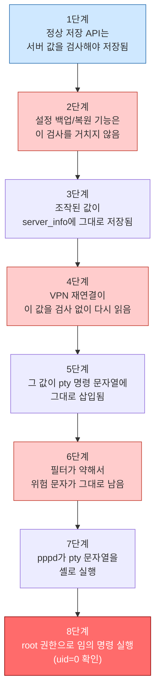
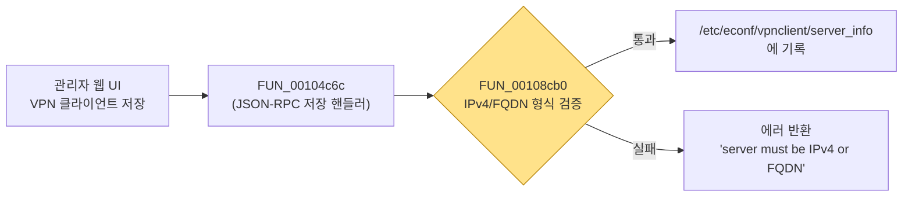

# ipTIME AX3000M PPTP VPN 클라이언트 커맨드 인젝션 분석

> ipTIME AX3000M 공유기 펌웨어(`ml_15_366` 빌드)의 OS Command Injection 취약점 분석 문서입니다.
> 2026-08-30 KISA에 신고 접수를 마쳤습니다. `test-kit/`으로 직접 재현할 수 있습니다.

---

## 0. 취약점 정보

| 항목 | 내용 |
|---|---|
| 취약점 유형 | OS Command Injection (CWE-78), 설정 파일을 매개로 한 간접 인젝션 |
| 대상 | ipTIME AX3000M(`ml_15_366`) — 형제 모델 ipTIME AX3KSM(`ml_15_366`, MT7981 ARM64/musl)도 취약 파일 SHA-256이 동일해 같은 취약점으로 판단. 그 외 MT7981 계열 iptime 모델은 코드 동일성을 개별 확인하지 않았으므로 별도 검증 필요 |
| 공격 조건 | 관리자 로그인 + "설정 백업 파일 복원" 실행 권한 필요 — **미인증(unauthenticated) 원격 공격이 아닙니다** |
| 영향 | root 권한 임의 명령 실행 (OS Command Injection) |
| 공개 상태 | 2026-08-30 KISA(한국인터넷진흥원) 취약점 신고 접수 완료 |

**한 줄 요약**

> 정상 저장은 검사함 → 백업 복원은 검사 안 함 → 재연결도 검사 안 함 → 그 값이 명령 문자열에 그대로 들어가 root 권한으로 실행됨. (그 문자열을 나중에 셸이 실제 명령어로 실행하기 때문에 문제가 됩니다.)

함수명과 코드 레벨 세부사항은 필요하지 않습니다 — 지금은 이 흐름만 기억하면 됩니다. 함수 이름이 궁금하면 1절 끝의 "기술 요약" 표를 참고하세요.

---

## 1. 취약점 발생 과정

이 취약점이 **정상 동작부터 시작해서** 어떻게 root 권한 명령 실행까지 이어지는지, 8단계로 순서대로 설명합니다.



1~4단계는 "왜 이상한 `server` 값이 걸러지지 않고 살아남는가"를 설명합니다. 5단계부터는 "그렇게 살아남은 값이 어디에 쓰이길래 위험한가"를 설명합니다.

### 1단계 — 정상 상태부터 시작


원래 VPN 서버 주소를 입력하면, 그 값이 IP나 도메인(FQDN) 형식인지 검사해서 이상한 값은 막습니다.



저장 핸들러 `FUN_00104c6c`가 검증 함수 `FUN_00108cb0`(`is_valid_ipv4_address`/`is_valid_fqdn`)을 부릅니다. 세미콜론 같은 값을 넣으면 여기서 바로 막혀 저장조차 안 됩니다. **이 경로만 쓰면 안전합니다** — 실제로 서버 필드에 `1.1.1.1`을 넣어 클라이언트를 만들어 봐도, IP 형식만 정상적으로 통과되는 걸 확인했습니다.

문제는 이 검증을 거치지 않는 **다른 입력 경로**가 있다는 것입니다.

### 2단계 — 다른 입력 경로가 있음


공유기에는 **설정 백업/복원 기능**이 있고, 이 기능은 설정 파일을 통째로 복원합니다. 문제는 여기서는 VPN 서버 주소가 정상적인 IP인지 **다시 검사하지 않는다**는 것입니다.

(전제조건: 관리자 로그인 상태 + "설정 백업 파일 복원" 실행 권한 — 0절 참고)

담당 함수는 1단계와 완전히 다릅니다 — `sbin/defaultconf`의 `backup_config`(백업 생성) / `restorebackup`·`extract_config_tar_gz`(복원)입니다.

> 아래 코드는 지어낸 예시가 아니라 **Ghidra로 실제 디컴파일한 결과**입니다. 다만 `backup_config`(백업을 **만드는** 쪽) 코드라서, 이 취약점의 핵심 증거(복원 시 검증이 없다는 것)를 직접 보여주진 않습니다. 백업 파일이 어떤 형식인지 이해하는 데 필요해서 먼저 보여드리는 것이고, 핵심 증거는 바로 다음의 **복원(restore) 경로 로직과 3단계의 실제 복원 결과**입니다.

**한 줄로 요약하면**: 백업 파일 구조를 분석해보니 실제 설정이 압축 파일 형태로 통째로 복원되고, 복원 시 `server` 값의 의미는 검사하지 않았습니다. (코드를 건너뛰어도 괜찮습니다.)

백업을 만드는 쪽(`backup_config`)의 디컴파일 코드입니다:

```c
sf_strncpy(local_80,"GEN_V2",0x10);
uVar7 = get_filesize("/tmp/config.tar.gz");
local_70 = CONCAT44(local_70._4_4_,uVar7);
fwrite(local_80,1,0x30,pFVar12);
fclose(pFVar12);
snprintf(local_80,0x80,"cat /tmp/config.tar.gz >> %s",pcVar14);
system(local_80);                        // server 값 검증 없이 tar payload를 그대로 이어붙임
```

`server`가 IP인지 페이로드인지 검사하는 코드가 없습니다. 복원 쪽(`extract_config_tar_gz`)도 마찬가지입니다 — 48바이트 헤더에서 `"GEN_V2"` 매직 문자열만 `strcmp`로 확인하고, 그 뒤는 필드 하나 들여다보지 않고 그대로 압축 해제해 `/etc/econf/`에 덮어씁니다.

즉 공격자가 `server` 필드에 `x;id > /home/httpd/192.168.0.1/id_result.txt;#` 같은 페이로드를 심어둔 백업 파일을 "설정 백업 복구" 메뉴(`시스템 관리 → 기타 설정`, 업로드 자체는 범용 업로드 CGI(예: `backup.cgi`)가 처리)로 올리면, 1단계의 검증을 거치지 않고 그대로 통과됩니다. **여기서 취약점의 틈이 처음 생깁니다.**

### 3단계 — 조작된 값이 실제 설정 파일에 들어감

그래서 세미콜론 같은 문자가 포함된 값도 `server_info`에 저장될 수 있습니다. 정적 분석만으로는 "그런 것 같다"에 그치므로, 실제로 업로드·복원한 뒤 파일을 직접 열어 확인했습니다. QEMU로 이 벤더의 rootfs를 통째로 띄운 환경에서 같은 시나리오를 실행한 결과입니다.

```
$ cat /data/etc/econf/vpnclient/server_info
[{"id": 1, "server": "x;touch /tmp/webrestore_marker;id>>/tmp/webrestore_marker;# ", ...}]
```

세미콜론과 `#`이 필터링 없이 그대로 파일에 들어가 있습니다. **원래 막히던 값이 우회해서 들어간 것**을 확인한 것입니다. 여기까지 `is_valid_ipv4_address()` / `is_valid_fqdn()` 같은 형식 검증은 한 번도 호출되지 않았습니다.

### 4단계 — VPN 재연결이 그 값을 다시 읽음

이후 재부팅이나 자동 재연결 때 `vpncli/connect`가 설정 파일을 다시 읽습니다. 그런데 여기서도 IP/FQDN 재검증을 하지 않습니다.

(백업 파일에 `"keep": true`를 심어두면 부팅 시 30~60초 주기 타이머가 자동으로 이 경로를 타므로, 관리자가 직접 "연결"을 누르지 않아도 됩니다.)

실행되는 코드는 `FUN_001074b4`("vpncli/connect" 핸들러)입니다. 핵심은 딱 두 줄입니다 — 오염된 파일을 읽고, 검증 없이 다음 단계로 넘깁니다.

```c
FUN_00103e94("/etc/econf/vpnclient/server_info", auStack_20);
...
uVar2 = (**(code **)(lVar4 + 8))(lVar3);
```

쉽게 풀면: **파일을 읽은 다음, 프로토콜에 맞는 처리 함수로 바로 넘깁니다.** 그 사이에 값을 검사하는 코드는 없습니다. 파일은 읽지만 `FUN_00108cb0`(1단계의 그 IP/FQDN 검증 함수)은 다시 호출하지 않습니다. `FUN_00108cb0` 호출이 이 함수 전체 어디에도 없다는 것, 그리고 바이너리 전체에서 이 검증 함수가 불리는 곳은 1단계의 저장 핸들러 `FUN_00104c6c` 하나뿐이라는 것을 Ghidra 참조 데이터베이스로 확인했습니다. (함수 전체 코드는 부록 A 참고.)

> **추가 검증**: 화면 조작이나 재부팅 없이, 이 핸들러를 내부 IPC 소켓(`\0servd-ipc`)으로 직접 호출해도 결과는 같습니다. 오염된 `server_info`를 심어둔 채 `{"method":"vpncli/connect","params":1}`을 직접 보내면:
> ```
> RECV: {"result":"done"}
> $ cat /etc/ppp/peers/vpnconnection_1
> pty "/sbin/pptp x;touch /tmp/ipc_marker;id>>/tmp/ipc_marker;# --nolaunchpppd"
> ```
> 세미콜론과 `#`이 그대로 기록됩니다 — "재검증 없음"이 특정 화면 하나만의 문제가 아니라 이 핸들러 자체의 문제라는 뜻입니다. (재현 스크립트: `test-kit/advanced/ipc_verify.sh`)

**한 번 들어간 잘못된 값을 그대로 신뢰하고 계속 사용**하는 것이 이 단계의 핵심입니다.

### 5단계 — 그 값이 명령 문자열에 들어감


이제 이 값이 **어디에 쓰이길래 위험한지** 볼 차례입니다.

`pppd`는 VPN 클라이언트 연결(PPTP/L2TP)을 처리하는 리눅스 표준 데몬입니다. 설정 파일에 이런 줄을 쓸 수 있습니다.

```
pty "/sbin/pptp 1.2.3.4 --nolaunchpppd"
```

`pty` 지시어는 "이 명령을 실행하고, 표준입출력을 PPP 링크로 써라"라는 뜻입니다. `pppd`는 이 문자열을 **`/bin/sh -c "<문자열>"`로 그대로 실행**합니다 — 버그가 아니라 `pppd`의 정상 설계입니다(man pppd). 그래서 이 문자열을 만드는 쪽(`plugin_vpncli.so`)이 필터링 책임을 전부 져야 합니다.

PPTP 연결을 위해 정확히 이 `pty "/sbin/pptp [server] --nolaunchpppd"` 형태의 문자열을 만듭니다. 여기서 `server` 자리에 공격자가 넣은 문자열이 들어갑니다.

이 조립을 담당하는 코드가 `FUN_0010699c`(SINK)입니다. (**SINK**란 공격자가 조작한 값이 실제로 위험한 동작에 쓰이는 최종 지점을 뜻하는 용어입니다.)

```c
uVar4 = *(undefined8 *)(param_1 + 0x10);
...
pFVar3 = fopen(acStack_280, "w");
FUN_001063e8(uVar4, &DAT_00109fab);
FUN_0010693c(&local_200, uVar5);
fprintf(pFVar3,
    "pty \"/sbin/pptp %s --nolaunchpppd\"\nname \"%s\"\nremotename PPTP\n"
    "require-mppe-128\nfile /etc/ppp/options.pptp\n",
    uVar4, &local_200);                       // server 값을 pty 지시어에 그대로 삽입
...
fclose(pFVar3);
...
_bg_cmd(6, {"pppd","call",<peer_name>,NULL}, 0);
```

`fprintf`가 `server` 값을 `%s` 자리에 그대로 끼워 넣어 `/etc/ppp/peers/vpnconnection_<id>` 파일에 씁니다. 필터(`FUN_001063e8`)를 한 번 거치긴 하지만, 그 필터가 얼마나 부실한지는 다음 단계에서 보입니다.

### 6단계 — 필터가 약해서 위험 문자가 그대로 남음

이 필터는 위험한 문자를 모두 막는 게 아니라, `\n`, `\r`, `"` 딱 3개만 지웁니다. `;`나 `#`는 막지 못합니다.

```c
void FUN_001063e8(byte *param_1,char *param_2)
{
  byte bVar1;
  char *pcVar2;
  byte *pbVar3;
  byte *pbVar4;

  pbVar4 = param_1;
  if (param_1 == (byte *)0x0) {
    return;
  }
  while (true) {
    bVar1 = *pbVar4;
    if (bVar1 == 0) break;
    pcVar2 = strchr(param_2, (uint)bVar1);
    pbVar3 = param_1;
    if (pcVar2 == (char *)0x0) {                // 제거 목록(param_2)에 없는 글자는 필터링되지 않고 그대로 유지
      pbVar3 = param_1 + 1;
      *param_1 = bVar1;
    }
    param_1 = pbVar3;
    pbVar4 = pbVar4 + 1;
  }
  *param_1 = 0;
  return;
}
```

두 번째 인자 `&DAT_00109fab`는 Ghidra가 문자열로 자동 인식하지 못해 주소만 보이는데, 그 주소의 실제 바이트를 직접 열어보면:

```
DAT_00109fab: \x0a \x0d \x22 \x00 ...
              (LF)  (CR)  (")  (널 종료)
```

딱 이 3바이트뿐입니다. `;`(0x3b) `` ` ``(0x60) `$`(0x24)는 이 안에 없어서, `strchr`가 찾지 못하고 그대로 통과시킵니다.

| 방식 | 정의 | 이번 사례 |
|---|---|---|
| 블랙리스트 | 위험한 것만 골라 막는다 | `\n \r "` 세 개만 막고 `; \| & $ ( )`는 놓침 |
| 화이트리스트 | 안전한 형태만 통과시킨다 | `FUN_00108cb0`(1단계) — IP/도메인 형식만 통과시키면 세미콜론이 낄 자리가 없음 |

벤더는 화이트리스트 함수를 이미 갖고 있었습니다(1단계의 `FUN_00108cb0`). 문제는 이 검증이 1단계(최초 저장)에서만 불리고, 4단계의 재적용 경로에서는 안 불린다는 것입니다. 그래서 **조작된 명령 구조가 그대로 완성됩니다.**

### 7단계 — pppd가 셸로 실행


정상적인 경우와 비교하면 차이가 분명합니다.

```
정상:  pty "/sbin/pptp 1.2.3.4 --nolaunchpppd"
조작:  pty "/sbin/pptp x;id;# --nolaunchpppd"
```

`pppd`는 이 `pty` 문자열을 `/bin/sh -c "<문자열>"`로 그대로 실행합니다(5단계에서 본 대로, 버그가 아니라 `pppd`의 정상 설계입니다). 셸은 `;`를 명령 구분자로 해석해서 `/sbin/pptp x`를 실행한 뒤 이어서 `id`까지 실행하고, `#` 뒤는 주석 처리해 남는 `--nolaunchpppd`를 무력화합니다.

### 8단계 — root 권한 실행 확인

`pppd`가 root 권한으로 실행되기 때문에, 주입된 명령도 root 권한으로 실행됩니다.

`pppd`는 네트워크 인터페이스를 만들어야 해서 전통적으로 root로만 실행됩니다(`getuid()==0`이 아니면 자체적으로 거부). `plugin_vpncli.so`를 부르는 `serviced`/`servd` 체인 자체가 이미 root 데몬이라, `pppd` 기동도 자연스럽게 root입니다.

실제로 확인한 `id` 명령의 출력은 `uid=0 gid=0 groups=0`이었습니다. 지금까지의 증거가 직접 입증하는 것은 `uid=0` 상태에서 임의 명령이 실행된다는 사실이며, **root 권한 OS Command Injection / arbitrary command execution**입니다. 대화형 셸을 열지 않았더라도, root 권한으로 임의 명령을 실행할 수 있다는 점에서 시스템 전체에 대한 심각한 영향이 가능합니다.

### 검증 방법 정리

위 "취약점 발생 과정"(1~8단계)과는 별개로, 이 결과를 **어떻게 증명했는지**를 난이도를 높여가며 세 가지 방식으로 재확인했습니다.

| 방법 | 무엇을 확인했나 | 재현 위치 |
|---|---|---|
| ① SINK 단독 재현 | 손으로 만든 설정 파일을 QEMU에서 `pppd`로 직접 실행 → 마커 파일에 `uid=0` 기록 | `test-kit/sink-only/` |
| ② IPC 직접 호출 | UI·재부팅 없이 내부 소켓으로 `vpncli/connect` 호출 → 필터 없이 그대로 기록 (4단계 "추가 검증" 참고) | `test-kit/advanced/ipc_verify.sh` |
| ③ 전체 체인 E2E | 실제 관리자 UI에서 1~7단계를 그대로 재현 → HTTP GET으로 `uid=0` 확인 | `test-kit/GUIDE.md`, `evidence/` |

①의 실행 로그입니다 — 실기기의 `pppd`·`libc`·취약 함수와 SHA-256이 같은 바이너리를 QEMU로 직접 돌렸습니다.

```
$ cat stage/vpnconnection_test.conf
pty "/sbin/pptp x;touch /tmp/ax3000m_pptp_marker;id>>/tmp/ax3000m_pptp_marker;# --nolaunchpppd"
remotename PPTP
require-mppe-128

$ sudo bash run.sh
...
$ cat /tmp/ax3000m_pptp_marker
uid=0 gid=0 groups=0
```

③은 Docker 환경에 `servd` + `lighttpd` + 실제 관리자 UI를 통째로 띄우고 1~7단계를 화면 그대로 재현한 뒤, `id`의 출력을 라우터 자신의 웹 문서 루트(`home/httpd/192.168.0.1/id_result.txt`)에 쓰는 페이로드를 사용한 결과입니다.

```
$ curl http://127.0.0.1:8080/id_result.txt
uid=0 gid=0 groups=0
```

**이 GET 요청 자체가 공격은 아닙니다** — 실제 공격(2~4단계: 관리자 로그인 후 조작된 백업 파일 복원)은 이미 끝났고, 이 GET은 그 결과가 정말 실행됐는지를 외부에서 확인하는 검증 단계일 뿐입니다. 검증자가 대상 내부 셸에 직접 접근하지 않고, HTTP 응답만으로 성공 여부를 확인했다는 점에서 ③이 가장 강한 증거입니다. 전체 재현 과정의 실행 로그 스크린샷 12장은 `evidence/step01-1.png` ~ `step12-12.png`에 있습니다.

### 게이트별 정리

여기서 **게이트**란 `server` 값이 안전한지 검사할 수 있었던 지점을 의미합니다. 1~8단계를 관통하는 사실은 이겁니다: 이런 게이트가 네 곳 있는데, 그중 두 곳이 비어 있습니다.

| # | 게이트 | 담당 함수 | 요구조건 | 실제 상태 | 대응 단계 |
|---|---|---|---|---|---|
| 1 | 신규 저장 시 검증 | `FUN_00108cb0` (호출부: `FUN_00104c6c`) | IP/도메인 형식 통과 필요 | **정상 작동** — 이 경로만 쓰면 안전 | 1단계 |
| 2 | 백업/복원 | `sbin/defaultconf`의 `backup_config` / `restorebackup` | `/etc/econf/*` 전체를 tar로 백업/복원 | **내용 검증 없음** — 실질적 우회 지점 | 2~3단계 |
| 3 | 재적용(reconnect) | `FUN_001074b4` → `FUN_00103e94` | 파일에서 읽은 `server` 값을 IPv4/FQDN으로 재검증해야 함 | **server 값 재검증 없음** | 4단계 |
| 4 | 문자 필터 | `FUN_001063e8` | 위험 문자 제거 | `\n`, `\r`, `"` 세 글자만 — **불충분** | 5~6단계 |

게이트 1과 3의 차이가 취약점의 본질입니다.

```
같은 server 값을 다루는 코드가 두 곳
  ├─ 저장할 때 (게이트 1, 1단계)  → 검증함
  └─ 재적용할 때 (게이트 3, 4단계) → 검증 안 함
```

"저장할 때 이미 검증했으니 파일은 항상 유효하다"는 암묵적 믿음이, 검증 없이 그 파일에 쓸 수 있는 경로(게이트 2, 2~3단계)의 존재로 깨집니다. 즉, **처음 저장할 때만 검사하고 나중에 다시 읽을 때는 이미 안전하다고 믿는** *validate-on-write, trust-on-read* 설계입니다. 이 네 게이트를 각각 어떻게 고치는지는 2절에서 다룹니다.

### 기술 요약 (함수 레퍼런스)

앞선 설명에 나온 함수·파일 이름을 한곳에 모았습니다. 처음 읽을 때는 몰라도 되고, 나중에 코드를 다시 찾아볼 때 쓰는 표입니다.

| 항목 | 내용 |
|---|---|
| 취약 파일 | `usr/service.plugin/plugin_vpncli.so` |
| SINK 함수 (5단계) | `FUN_0010699c` — `pty` 지시어 조립 |
| 불충분 필터 함수 (6단계) | `FUN_001063e8` — `\n \r "` 3글자만 제거 |
| 정상 검증 함수 (1단계) | `FUN_00108cb0`(`is_valid_ipv4_address`/`is_valid_fqdn`), 호출부 `FUN_00104c6c` |
| 재검증 누락 지점 (4단계) | `FUN_001074b4`("vpncli/connect" 핸들러) |
| 검증 우회 경로 (2단계) | `sbin/defaultconf`의 `restorebackup()`/`extract_config_tar_gz` |
| 최종 실행 데몬 (7~8단계) | `pppd` — `/bin/sh -c`로 `pty` 문자열 실행, root 권한 |

---

## 2. 근본 원인 & 수정 방안

**공통 원인**: "값이 유효한 IP/FQDN인지" 검사 코드(`FUN_00108cb0`)가 이미 있었는데, 그 값이 시스템에 도달할 수 있는 **모든** 경로에 일관되게 적용되지 않았습니다. 저장할 때(1단계)는 걸리고, 복원·재적용할 때(2~4단계)는 안 걸립니다.

**권장 수정 순서** — 가장 확실한 마지막 방어선은 SINK 직전 재검증이고, 구조적으로는 복원 이후 검증과 셸 의존 제거까지 가는 것이 이상적입니다. 블랙리스트 필터 확장은 보조 수단일 뿐, 그 자체로는 근본 해법이 아닙니다.

1. **SINK 직전 whitelist 재검증 (마지막 방어선)** — `FUN_0010699c`가 `pty` 문자열을 조립하기 전에 `FUN_00108cb0`(IPv4/FQDN 검증)을 반드시 통과시킵니다. 형식이 맞는 값에는 애초에 쉘 메타문자가 들어갈 수 없으므로, 이 한 가지만으로도 근본 원인이 해결됩니다.
2. **복원 후 스키마 검증** — `restorebackup()`이 압축을 풀고 난 뒤, `server_info` 같은 민감 파일에 대해 다시 한 번 형식 검증을 수행합니다. 백업 파일에 서명(HMAC 등)을 추가해 "벤더가 만든 백업"만 복원되게 하는 것도 방법입니다.
3. **(가능하면) 셸 문자열 조립 구조 자체를 제거** — `pppd`를 `pty "<문자열>"`(셸 파싱을 거침) 대신 `pptp`/서버 주소/`--nolaunchpppd`를 각각 별도 인자로 넘기는 argv 배열 방식으로 기동하면, 애초에 `/bin/sh -c` 파싱 자체가 없어져 이 클래스의 취약점이 사라집니다.

| # | 파일/함수 | 정확한 문제 | 권장 수정 | 우선순위 |
|---|---|---|---|---|
| 1 | `plugin_vpncli.so : FUN_0010699c` (SINK) | `pty` 조립 전에 whitelist 검증을 거치지 않음 | `pty` 조립 직전에 `FUN_00108cb0`을 재사용해 값이 IPv4/FQDN 형식인지 확인 | **최우선** — 근본 원인 해결 |
| 2 | `sbin/defaultconf`의 `restorebackup`/`extract_config_tar_gz` | 백업 아카이브 내용에 대한 의미론적 검증이 전혀 없음 | 복원 직후 민감 파일에 스키마/형식 검증 추가, 가능하면 백업 파일 서명(HMAC) 검증 | 2순위 — 우회 경로 자체를 막음 |
| 3 | `plugin_vpncli.so : FUN_001074b4` ("vpncli/connect") | 파일에서 다시 읽은 `server` 값을 재검증 없이 SINK로 전달 | 이 핸들러 진입 시점에 `FUN_00108cb0`을 다시 호출 (validate-on-read) | 3순위 — 1번과 함께 적용하면 이중 방어 |
| 4 | `plugin_vpncli.so : FUN_001063e8` (필터) | 블랙리스트 필터가 `\n \r "` 세 글자만 제거 | 1번(whitelist 재검증)이 적용되면 이 필터는 불필요해짐. 그 전까지 임시로 쉘 메타문자 전체를 제거/이스케이프할 수는 있으나, **블랙리스트 확장은 근본 해법이 아닙니다.** | 최하위 — 보조 수단일 뿐 |
| 5 | `vpncli/timer/start` 자동 재연결 콜백 | 사용자 상호작용 없이 자동으로 `vpncli/connect` 호출 | (버그는 아니지만) 1~3번이 고쳐지면 자연히 안전해짐 | — |

---

## 3. 이 파일 묶음 사용법

```
ax3000m-pptp-cmdi/
├── report.md                 # 이 문서
├── walkthrough/               # 1절 내용에 대응하는 화면 캡처 5장 + 코드 캡처 3장 (본문은 텍스트로 설명, 원본 이미지는 참고용)
├── evidence/                 # 1절 "검증 방법 정리"에서 언급한 전체 재현 과정 스크린샷 12장
└── test-kit/
    ├── GUIDE.md               # 실습 가이드 (여기부터 시작할 것)
    ├── run.sh                 # 실제 관리자 웹 UI 전체를 Docker로 띄우는 스크립트 (약 120MB, 호스트 sudo 불필요)
    ├── Dockerfile / rootfs/   # run.sh가 빌드하는 이미지 + 벤더 펌웨어 전체 rootfs
    ├── advanced/              # 웹 UI 복원 메뉴에 올릴 조작된 백업 파일 + IPC 직접 호출 스크립트
    └── sink-only/             # 경량 버전: pppd 싱크 자체만 몇 초 안에 확인 (약 2MB, 브라우저 불필요)
```

```
시작 ──▶ test-kit/GUIDE.md 읽기
     ──▶ bash run.sh 로 실제 관리자 웹 UI 띄우기 (http://127.0.0.1:8080/ui/)
     ──▶ "설정 백업 복구 → 복원" 메뉴에 advanced/test_backup.cfg 업로드
     ──▶ 1절에서 설명한 1~8단계 그대로 재현
```

컨테이너 자체의 root로 `pppd`의 root 요구를 통과시키므로 호스트 sudo는 필요 없습니다(도구가 없으면 자동 설치). 원리만 빠르게 확인하고 싶다면 `test-kit/sink-only/run.sh`로 `pty` 지시어의 쉘 실행 하나만(1절 "검증 방법 정리" ① 참고) 확인할 수 있습니다. (그 최초 증거 캡처는 `sudo bwrap`으로 같은 지점을 확인한 것이고, 이 kit들은 호스트 sudo 없이 컨테이너 자체의 root로 같은 지점을 재현하는 동등한 방법입니다.)

## 4. 책임 있는 사용에 대한 안내

- 이 취약점은 **2026-08-30 KISA에 정식 신고가 접수된 상태**입니다. 이 문서는 신고 이후 정리한 분석 자료이며, 실제 미공개 취약점을 무단으로 유포하는 것이 아닙니다.
- `test-kit/run.sh`는 **격리된 Docker 컨테이너** 안에서만 실행되도록 설계되어 있습니다(호스트 파일시스템 미접근, `--network host`에서도 lighttpd는 `127.0.0.1`에만 바인딩). 실제로 동작 중인 공유기(본인 소유든 타인 소유든)를 대상으로 이 페이로드를 시험하지 마십시오 — 실제 서비스 거부/기기 손상/법적 문제로 이어질 수 있습니다.
- **`test-kit/run.sh`는 벤더의 실제 상용 펌웨어 rootfs(관리자 UI/CGI 바이너리 포함)를 통째로 담고 있습니다.** 이 패키지를 조직 내부 범위를 넘어 더 넓게 재배포할 계획이라면, 벤더 상용 코드 재배포에 따른 저작권/라이선스 문제를 먼저 검토하십시오. 원리 설명과 가벼운 재현만으로 충분하다면 `test-kit/sink-only/`(약 2MB, 취약 바이너리만 포함)를 대신 공유하는 편이 안전합니다.
- 본인이 소유·관리하는 실기기에서 검증하고 싶다면, 먼저 벤더의 공식 보안 패치 유무를 확인하고, 격리된 네트워크에서, 본인 책임 하에 진행하시기 바랍니다.

---

## 부록 A: 전체 함수 코드 — `FUN_001074b4`

4단계 본문에는 핵심 2줄만 발췌했습니다. 전체 함수는 다음과 같습니다.

```c
undefined4 FUN_001074b4(undefined8 param_1,long *param_2)
{
  int iVar1;
  undefined4 uVar2;
  char *__nptr;
  long lVar3;
  long lVar4;
  undefined1 auStack_20 [32];

  if (*param_2 == 0) {
    return 0xfffff8303;
  }
  if (*(int *)((long)param_2 + 0xc) != 2) {
    return 0xffff80a6;
  }
  __nptr = (char *)jsondup(param_2);
  if (__nptr == (char *)0x0) {
    return 0xffff80a5;
  }
  iVar1 = atoi(__nptr);
  free(__nptr);
  uVar2 = lock_file("vpncli_server_config");
  FUN_00103e94("/etc/econf/vpnclient/server_info",auStack_20);   // 오염된 파일을 그대로 읽음
  unlock_file(uVar2);
  lVar3 = FUN_00103e4c(iVar1,auStack_20);
  if (lVar3 != 0) {
    call_service("vpncli/status/notification","{vpn_id:%d, status:%Q}",*(undefined4 *)(lVar3 + 8),
                 "connecting");
    if (((*(long *)(lVar3 + 0x18) != 0) && (lVar4 = FUN_001063a4(), lVar4 != 0)) &&
        (*(code **)(lVar4 + 8) != (code *)0x0)) {
      uVar2 = (**(code **)(lVar4 + 8))(lVar3);
      goto LAB_00107534;
    }
  }
  uVar2 = 0xffff80a5;
  LAB_00107534:
  free_all_list(auStack_20,FUN_00103de4);
  return uVar2;
}
```

요청 자체는 null 여부·타입·`jsondup`/`atoi`로 정상적으로 파싱합니다(12~21행). 문제는 그다음입니다 — `FUN_00103e94`로 파일을 읽고(24행), `FUN_001063a4()`로 찾은 프로토콜별 함수포인터를 곧장 호출할 뿐(31행), 그 사이 어디에도 `FUN_00108cb0`(IPv4/FQDN 검증) 호출이 없습니다.

---

## 부록 B: 원본 분석 문서 대응표

| 이 문서의 절 | 원본 엔진지먼트 파일 |
|---|---|
| 1절 (화면 서술의 원본 캡처) | 사용자 촬영 원본 (Desktop `command_injection/` 캡처 세션) — `walkthrough/`에 동봉 |
| 1절 (코드 증거: xref, 바이트 덤프, `backup_config` 디컴파일 등) | `analysis/candidates/CMDI-AX3000M-vpncli-pptp-pty-injection.md`, `analysis/evidence/CMDI-AX3000M-vpncli-pptp-pty/evidence-log.md`(Step 9) |
| 1절 (동적 검증: QEMU/IPC/웹 UI 재현) | `analysis/emulation/CMDI-AX3000M-pptp-pty/GUIDE.md`, `results.md`, `analysis/emulation/webui-env/README.md` |
| evidence/ | `analysis/evidence/CMDI-AX3000M-vpncli-pptp-pty/evidence-log.md` |
| KISA 신고서 | `analysis/emulation/CMDI-AX3000M-pptp-pty/kisa 신고 접수 리스트 (작성본).txt` |
